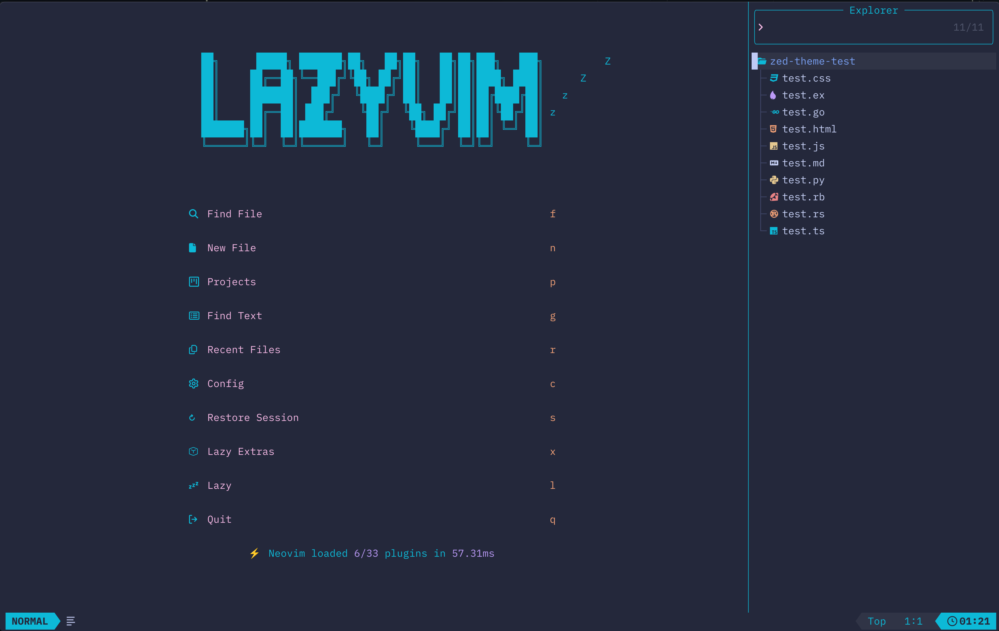
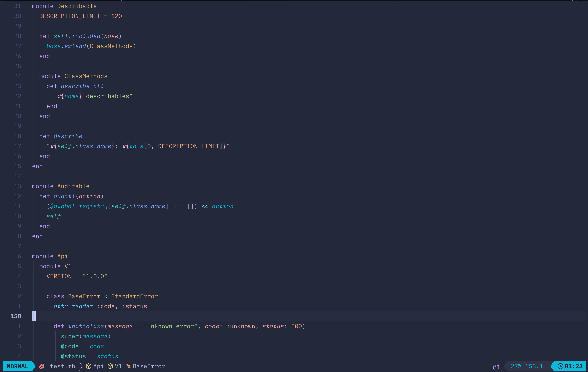
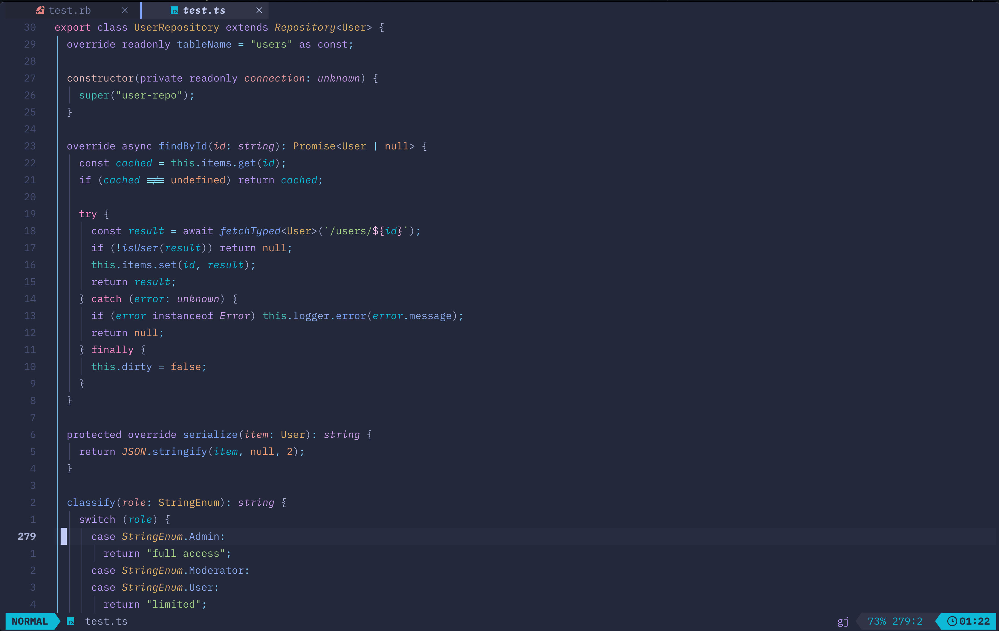
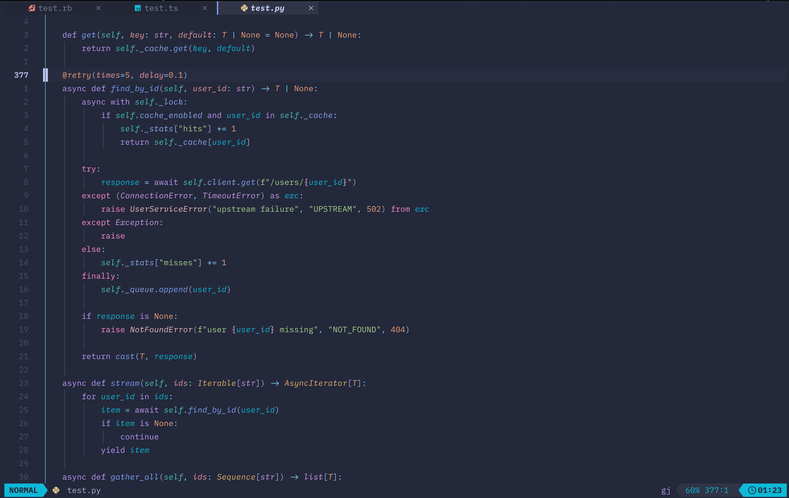
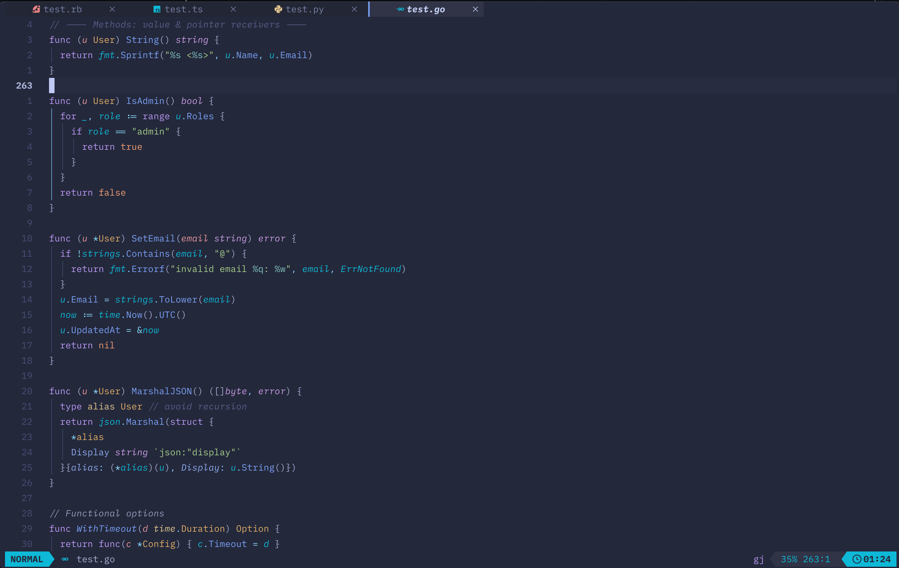

# tokyoppuccin.nvim

A Neovim colorscheme ported from my Zed theme **Tokyoppuccin Storm** — a
Catppuccin-flavored take on Tokyo Night Storm (as of August 2026).



> **Status: usable, pre-1.0.** Licensed, installable, and in daily use.
> Storm is the only variant. Testers welcome — open an issue with a screenshot
> and the filetype if a group looks wrong.

<details>
<summary><b>More screenshots</b> — Ruby, TypeScript, Python, Go</summary>

### Ruby



### TypeScript



### Python



### Go



</details>

## Requirements

Neovim **0.10+** (uses `@lsp.*` semantic-token groups and the memoized
`vim.treesitter.query.get` cache).

## Install

[lazy.nvim](https://github.com/folke/lazy.nvim):

```lua
{
  "EmmanuelVernet/tokyoppuccin.nvim",
  lazy = false,
  priority = 1000,
  opts = {},                        -- see Config; lazy.nvim passes this to setup()
  config = function(_, opts)
    require("tokyoppuccin").setup(opts)
    vim.cmd.colorscheme("tokyoppuccin")
  end,
}
```

`setup()` is optional — the colorscheme loads with the defaults below if it is
never called. Any other plugin manager works too; nothing here is lazy-specific.

```vim
:colorscheme tokyoppuccin          " whichever style setup{} configured
:colorscheme tokyoppuccin-storm    " pin a variant regardless of config
```

Either name works. `vim.g.colors_name` is always the suffixed form
(`tokyoppuccin-storm`), so lualine's `theme = "auto"` resolves correctly.

## What's styled

Editor UI, diagnostics, diff, git signs, LSP references, legacy syntax,
treesitter `@*` captures, and `@lsp.*` semantic tokens. Plugins:

| Plugin | Wiring |
| --- | --- |
| [lualine.nvim](https://github.com/nvim-lualine/lualine.nvim) | `theme = "auto"` (or `"tokyoppuccin"`) |
| [snacks.nvim](https://github.com/folke/snacks.nvim) | automatic — notifier, dashboard, profiler, indent, input, picker, explorer |
| [mini.icons](https://github.com/nvim-mini/mini.icons) | automatic |
| [bufferline.nvim](https://github.com/akinsho/bufferline.nvim) | manual, see below |

Anything else falls back to the linked default groups. That is expected, not a
bug — but open an issue if a group looks obviously wrong.

### bufferline.nvim

bufferline re-derives every `BufferLine*` group from `Normal` on its own
`ColorScheme` autocmd, so whatever the colorscheme sets is clobbered a moment
later. The only override that survives is bufferline's own `highlights` key:

```lua
{
  "akinsho/bufferline.nvim",
  opts = { highlights = require("tokyoppuccin.bufferline").get() },
}
```

`get(style)` takes an optional style name and falls back to `"storm"`.

## Config

```lua
require("tokyoppuccin").setup({
  style = "storm",
  transparent = false,      -- clear Normal/NormalFloat/SignColumn backgrounds
  terminal_colors = true,   -- set vim.g.terminal_color_*
  ruby_queries = false,     -- opt-in treesitter overrides, see below
  styles = {
    comments = { italic = true },
    keywords = {},
    functions = {},
    variables = { italic = true },
  },
  on_colors = function(colors) end,         -- mutate palette before groups build
  on_highlights = function(hl, colors) end, -- final override hook
})
```

`styles.*` values are `nvim_set_hl` attribute tables — `{ italic = true }`,
`{ bold = true, underline = true }`, `{}` for plain.

There is no `plugins = { all, auto }` option — `groups/plugins/init.lua` is a
hand-maintained `enabled` list on purpose. Add a file, add its name.

### Ruby query overrides

`ruby_queries = true` appends `extras/` to the runtimepath, which activates
`extras/queries/ruby/highlights.scm`. Needs the nvim-treesitter `ruby` parser
installed — without it the file is never read and the flag is a no-op. It
changes three things:

| Token | Default | With the flag |
| --- | --- | --- |
| `require` etc. **inside** a class/module/method | `@function.call` | `@keyword.import` |
| `autoload` | `@function.call` | `@keyword.import` |
| `begin` | `@keyword` | `@keyword.exception` |

Top-level `require` is already `@keyword.import` upstream — nvim-treesitter
scopes its rule to `(program)`, so only nested calls need the override. `begin`
exists because `rescue`/`ensure` are re-captured as `@keyword.exception` upstream
and `begin` is not, which splits one construct across two colors.

The flag is read when the colorscheme loads, so set it in `setup()` before
`:colorscheme`. Flipping it later takes effect on the next
`:colorscheme tokyoppuccin` — open Ruby buffers are restarted, so no reopen
needed.

**Off by default** — a colorscheme changing what the *parser* captures is
surprising. The overrides are also torn down on `ColorSchemePre` when a
non-`tokyoppuccin*` scheme loads, so they never leak into another theme:
the runtimepath entry is removed, the memoized query cache is cleared, and live
Ruby buffers are restarted.

## Layout

```
colors/
├── tokyoppuccin.lua               -- unsuffixed alias -> load() with configured style
└── tokyoppuccin-storm.lua         -- thin entry point -> load("storm")
lua/tokyoppuccin/
├── init.lua                       -- setup(opts) + load(style); hi clear, apply, terminal colors
├── config.lua                     -- defaults + vim.tbl_deep_extend user merge
├── palette.lua                    -- THE color table, keyed by style
├── theme.lua                      -- build(opts) -> groups, colors, opts
├── util.lua                       -- blend helpers
├── bufferline.lua                 -- NOT in the highlight table; fed to bufferline's own setup
└── groups/
    ├── init.lua                   -- editor + syntax + plugins
    ├── editor.lua                 -- UI shell, diagnostics, diff, git signs, LSP references
    ├── syntax.lua                 -- legacy syntax + @treesitter + @lsp (single copy)
    └── plugins/
        ├── init.lua               -- dumb `enabled` list, no auto-detect machinery
        ├── mini_icons.lua
        └── snacks.lua             -- notifier, dashboard, profiler, indent, input, picker, explorer
lua/lualine/themes/
├── tokyoppuccin.lua               -- alias
└── tokyoppuccin-storm.lua
extras/queries/ruby/highlights.scm -- OFF the rtp unless ruby_queries = true
```

Storm is the only variant at the moment (August 2026).

## License

MIT — see [LICENSE](LICENSE).

Derived from [tokyonight.nvim](https://github.com/folke/tokyonight.nvim)
(Apache-2.0) and the [Catppuccin](https://github.com/catppuccin/catppuccin)
Frappé palette (MIT). See [THIRD-PARTY-NOTICES.md](THIRD-PARTY-NOTICES.md).
Not affiliated with or endorsed by either project.
